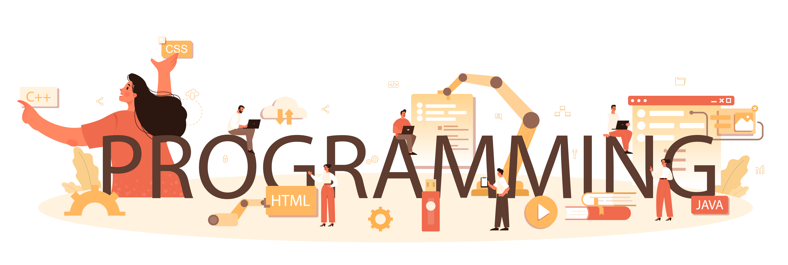

&nbsp;

<h2>Hello World! I'm Aleksander</h2>

### 👨🏻‍💻&nbsp; About Me

🎓 I'm currently studying new technologies.    
💻 I like to write code. And I want to improve my skills.        

### 🛠 Tech stack  &nbsp;

&nbsp;
&nbsp;
&nbsp;

&nbsp;
&nbsp;